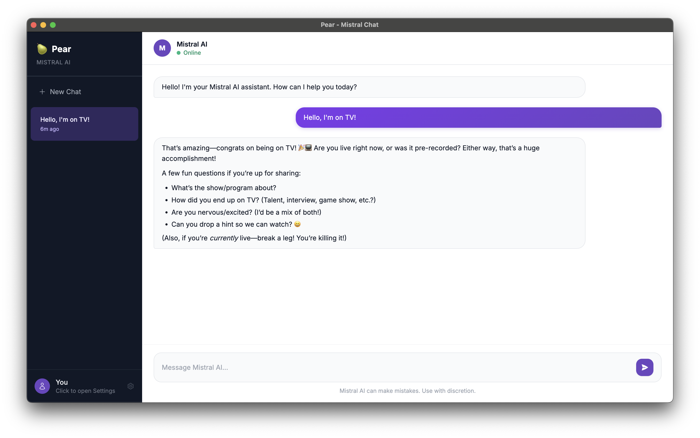

# Pear - Mistral AI Desktop Client

A lightweight Electron-based desktop application for interacting with Mistral AI's API.

## Features

- **Clean UI**: Built with Tailwind CSS and DaisyUI
- **Multi-model Support**: Switch between different Mistral AI models
- **Conversation History**: Save and manage chat history
- **Settings Management**: Configure API keys and preferences
- **Cross-platform**: Works on macOS, Windows, and Linux

## Installation

### Prerequisites

- Node.js (v16 or later)
- npm or yarn
- Git

### Clone the Repository

```bash
git clone https://github.com/nekosheen/pear.git
cd pear
```

### Install Dependencies

```bash
npm install
```

### Run the Application

```bash
npm start
```

### Build for Production

```bash
npm run build
```

## Configuration

Create a `.env` file in the root directory with your Mistral API key:

```env
MISTRAL_API_KEY=your_api_key_here
```

## Project Structure

```
src/
├── api/              # API services and managers
├── components/       # UI components
├── main/             # Electron main process
├── renderer/         # Electron renderer process
└── styles/           # CSS and styling
```

## Available Scripts

- `npm start`: Start the Electron app in development mode
- `npm run build`: Build the app for production
- `npm test`: Run tests (if applicable)

## Technologies Used

- **Framework**: Electron
- **UI**: Tailwind CSS with DaisyUI
- **Language**: TypeScript
- **API**: Mistral AI

## Development

### Adding New Features

1. Create a new branch: `git checkout -b feature/your-feature`
2. Make your changes
3. Commit: `git commit -m "Add your feature"`
4. Push: `git push origin feature/your-feature`
5. Create a pull request

### Running Tests

```bash
npm test
```

## Contributing

Contributions are welcome! Please follow these guidelines:

1. Fork the repository
2. Create your feature branch
3. Commit your changes
4. Push to your branch
5. Open a pull request

## License

MIT

## Support

For issues, questions, or feature requests, please open an issue on GitHub.

## Screenshots



## Roadmap

- [ ] Add more Mistral AI models
- [ ] Implement conversation search
- [ ] Add export functionality
- [ ] Improve error handling
- [ ] Add unit tests
