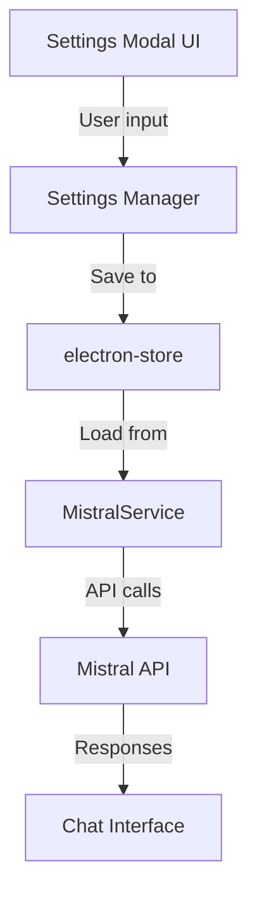

# Settings Implementation Plan for Mistral API Key and Model Selection

## Current State Analysis

### Current Implementation Issues
1. **Hardcoded API Key**: The Mistral API key is hardcoded in `src/renderer/renderer.ts` (line 12)
2. **No Model Selection**: The model is hardcoded as 'mistral-tiny' in the MistralService constructor
3. **No Settings UI**: There's a settings icon in the header but no functionality behind it

### Current Code Structure
- `MistralService` class handles API communication with configurable API key and model
- Electron app with main process and renderer process
- Tailwind CSS + DaisyUI for styling
- Settings icon already exists in header (line 82-86 in index.html)

## Proposed Architecture

### Data Flow


### Component Structure
```
src/
├── api/
│   ├── mistralService.ts          # Existing, will be enhanced
│   └── settingsManager.ts        # New - handles settings persistence
├── components/
│   └── SettingsModal.tsx         # New - settings UI component
└── renderer/
    ├── renderer.ts               # Existing, will be modified
    └── settingsController.ts     # New - bridge between UI and settings
```

## Implementation Steps

### 1. Add electron-store for Settings Persistence
- Install `electron-store` package
- Create `SettingsManager` class to handle:
  - Loading/saving API key
  - Loading/saving selected model
  - Validation of API key format
  - Default values

### 2. Create Settings Modal Component
- Create `SettingsModal.tsx` in components folder
- UI elements:
  - API Key input field with save button
  - Model selection dropdown (fetch from Mistral API)
  - Test connection button
  - Close/save buttons
- Styling with Tailwind CSS to match existing design

### 3. Modify MistralService
- Enhance constructor to accept settings manager
- Add method to fetch available models
- Add validation for API key

### 4. Create Settings Controller
- Bridge between modal UI and settings manager
- Handle modal open/close events
- Manage settings state
- Validate inputs before saving

### 5. Update Renderer Process
- Replace hardcoded API key with settings-loaded key
- Initialize settings manager on app start
- Add event listener for settings icon click
- Update MistralService initialization with dynamic settings

### 6. Update HTML Structure
- Add modal container to index.html
- Ensure settings icon has proper event binding

## Technical Details

### SettingsManager Interface
```typescript
interface SettingsManager {
  getApiKey(): string | null;
  setApiKey(apiKey: string): Promise<void>;
  getModel(): string;
  setModel(model: string): Promise<void>;
  getAvailableModels(): Promise<string[]>;
  validateApiKey(apiKey: string): boolean;
}
```

### Settings Modal Structure
```html
<div id="settings-modal" class="modal">
  <div class="modal-content">
    <h2>Settings</h2>
    
    <div class="form-group">
      <label>Mistral API Key</label>
      <input type="password" id="api-key-input">
      <button id="test-connection">Test Connection</button>
    </div>
    
    <div class="form-group">
      <label>Model</label>
      <select id="model-select">
        <option value="mistral-tiny">Mistral Tiny</option>
        <option value="mistral-small">Mistral Small</option>
        <!-- Dynamically populated -->
      </select>
    </div>
    
    <div class="modal-actions">
      <button id="cancel-settings">Cancel</button>
      <button id="save-settings">Save</button>
    </div>
  </div>
</div>
```

### Data Flow Sequence
1. User clicks settings icon → SettingsModal opens
2. SettingsModal loads current settings from SettingsManager
3. User modifies API key/model → SettingsModal validates inputs
4. User clicks Save → SettingsManager persists to electron-store
5. MistralService loads new settings on next API call

## Error Handling
- Validate API key format before saving
- Test API connection before allowing save
- Handle API errors gracefully with user feedback
- Provide clear error messages for invalid inputs

## Security Considerations
- Store API key securely using electron-store encryption
- Never log or expose API key in console/URLs
- Use password input type for API key field
- Clear API key from memory when not in use

## Testing Plan
1. Test settings persistence across app restarts
2. Test API key validation
3. Test model switching functionality
4. Test connection testing feature
5. Test error handling for invalid API keys
6. Test UI responsiveness and accessibility

## Timeline
This implementation can be completed in iterative phases:
1. Phase 1: Settings persistence and basic UI
2. Phase 2: Model selection and validation
3. Phase 3: Connection testing and error handling
4. Phase 4: Polish and testing